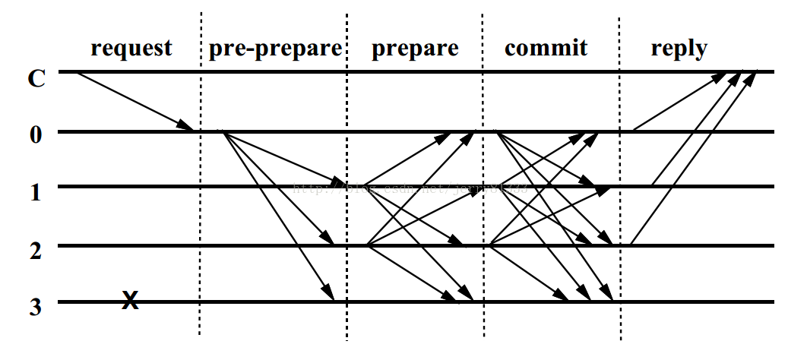
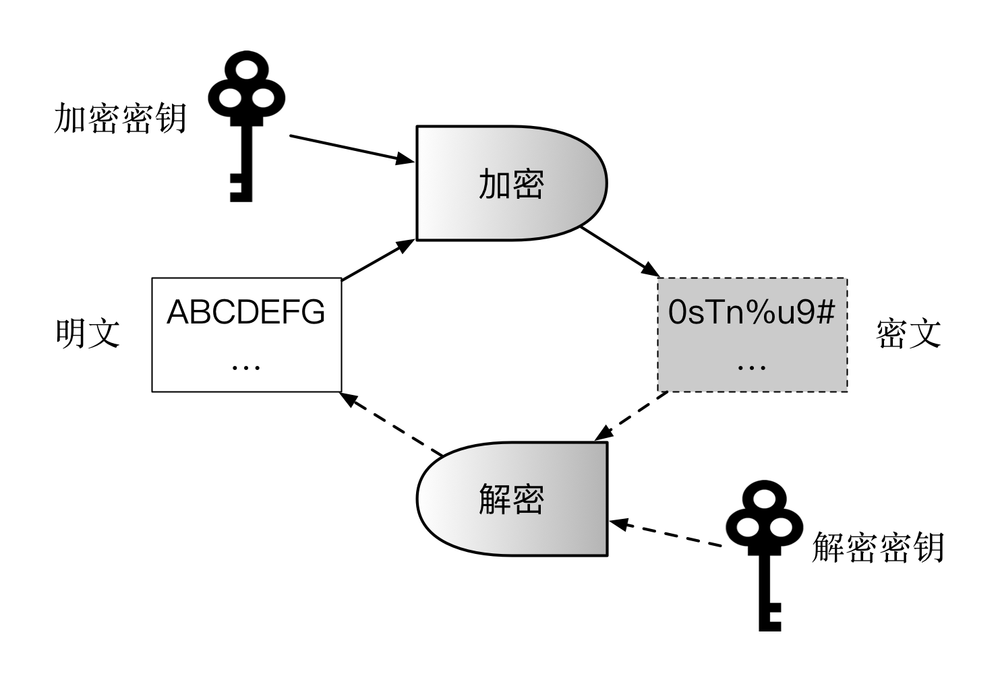
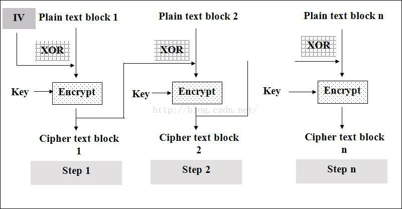
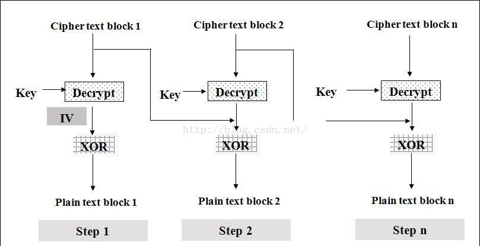
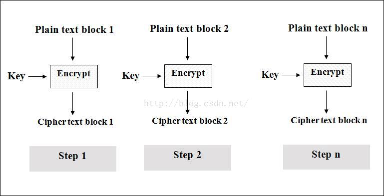
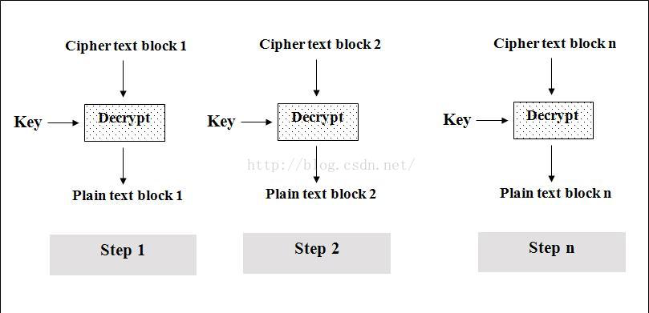
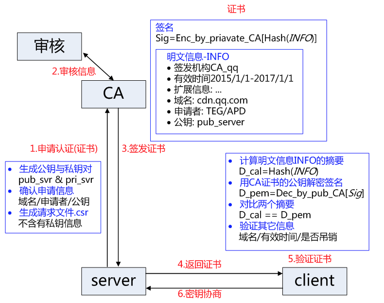
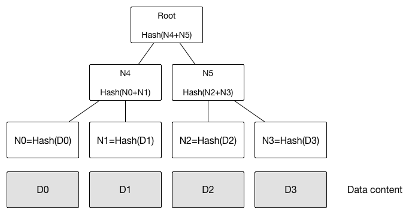
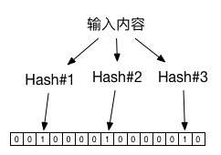

# [区块链技术指南](https://yeasy.gitbooks.io/blockchain_guide/)

## 分布式系统核心技术

### 共识算法

1. CFT（Crash Fault Tolerance）
    * Paxos
    * Raft
2. BFT（Byzantine Fault Tolerance）
    * PBTF：确定性系列算法
    * PoW： 概率算法
3. XFT （Cross Fault Tolerance）

    可以提供类似CFT的处理响应速度，并能在大多数节点正常工作时提供BFT保障。

4. Algorand

    基于PBTF进行改进，通过引入可验证随机函数解决了提案选择问题，理论上可以再容忍拜占庭错误的前提下实现更好的性能。

### FLP不可能原理

在网络可靠，但允许节点失效（即便只有一个）的最小化异步模型系统中，不存在一个可以解决一致性问题的确定性共识算法。FLP不可能原理告诉我们，**不要浪费时间，去试图为异步分布式系统设计面向任意场景的共识算法。**

### CAP原理

分布式系统无法同时确保一致性、可用性和分区容忍性，设计中往往需要弱化对某个特性的需求。

* 一致性（Consistency： 任何事务应该都是原子的，所有副本上的状态都是事务成功提交后的结果，并保持强一致。
* 可用性（Availability）：系统（非失败节点）能在有限时间内完成对操作请求的应答。
* 分区容忍性（Partition）：系统中的网络可能发生分区故障（成为多个子网，甚至出现节点上线和下线），即节点之间的通信无法保障，而网络故障不应该影响到系统正常服务。

#### 应用场景

* 弱化一致性：对结果一致性不敏感的应用，如网页，实时性较弱的查询类数据库等，简单分布式同步协议如Gossip， 以及CouchDB，Cassandra数据库等。
* 弱化可用性：对结果一致性很敏感的应用，如取款机等，MongoDB、Redis、MapReduce等。

    Paxos、Raft等共识算法，主要处理这种情况。在Paxos类算法中，可能存在着无法提供可用结果的情形，同时允许少数节点离线。
* 弱化分区容忍性： 两阶段的提交算法，某些关系型数据库以及ZooKeeper主要考虑了这种设计。实践中，网络可用通过双通道等机制增强可靠性。

### ACID原则与多阶段提交

#### ACID原则

* Atomicity: 每次事务都是原子的，事务包含的操作要么全部执行，要么全部不执行。
* Consistency：数据库的状态在事务执行前后的状态是一致的和完整的，无中间状态。
* Isolation: 各种事务可以并发执行，但彼此之间互相不影响。
* Durability：状态的改变是持久的，不会失效。

#### 两阶段提交

* 预提交
* 正式提交

缺点：
* 整个过程需要同步阻塞导致性能一般较差
* 存在单点问题
* 可能产生数据不一致的情况

#### 三阶段提交

* 尝试预提交
* 预提交
* 正式提交

### Paxos算法与Raft算法

#### Paxos算法

* 提案者(Proposer)
* 接受者(Acceptor)
* 学习者(Leaner)

两阶段提交
* 准备阶段
    - proposer向网络内超过半数的acceptor发送prepare消息
    - acceptor正常情况下回复promise消息
* 提交阶段
    - 在有足够多acceptor回复promise消息时，proposer发送accept消息
    - 正常情况下acceptor回复accepted消息

#### Raft算法

* 领导者(Leader)
* 候选者(Candidate)
* 跟随者(Follower)

[过程](http://thesecretlivesofdata.com/raft/)
* 领导者选举
* 同步日志

### 拜占庭问题与算法

拜占庭问题讨论的是允许存在少数节点作恶（消息可能被伪造）场景下如何达成共识问题。拜占庭容错算法解决的是在网络通信可靠，但节点可能故障情况下如何达成共识。实用拜占庭容错算法（Practical Byzantine Fault Tolerance， PBFT）采用密码学相关技术（RAS签名、消息验证编码和摘要）确保消息传递过程无法被篡改和破坏。

1. 通过轮换或随机算法选出某个节点为主节点，此后只要主节点不切换，则成为一个视图（View）
2. 在某个视图中，客户端将请求`<REQUEST,operation,timestamp,client>`发送给主节点，主节点负责广播请求到所有其它副本节点。
3. 所有节点处理完成请求，将处理结果`<REPLY,view,timestamp,client,id_node,response>`返回给客户端。客户端检查是否收到了至少f+1个来自不同节点的相同结果，作为最终结果。

主节点广播过程

## 密码学与安全技术

### Hash算法

1. MD4（RFC 1320），输出为128位，不够安全
2. MD5（RFC 1321），输出为128位，不具备“强抗碰撞性”
3. SHA系列
    1. SHA-1：输出为160位，不具备“强抗碰撞性”
    2. SHA-2
        * SHA-224
        * SHA-256（常用）
        * SHA-384
        * SHA-512
    3. SHA-3：（尚未实现）
4. 性能
    1. Hash算法多是计算敏感型
    2. 有一些是非计算敏感型，如scrypt，需要大量内存，可防止算力攻击
5. 数字摘要：对数字内容进行Hash运算，防止内容被篡改
6. 防止字典攻击和彩虹表攻击：加盐Hash

### 加解密算法

#### 对称加密

对称加密适用于大量数据的加解密过程，不能用于签名场景，需要提前分发好密钥。

对称加密每次只能处理固定长度的明文，因此对过长的内容需要采用一定模式进行分割加密。

1. 分组对称加密
    * DES： 64位明文 -> 64位密文，容易暴力破解
    * 3DES：三重DES操作
    * AES：处理速度快，目前尚未有有效破解手段
    * IDEA：类似3DES，密钥128位，加密强度更好
2. 序列密码：每次通过伪随机数生成器来生成伪随机数密钥串，如RC4等
3. 分组模式
    * CBC(Cipher Block Chaining)，明文按照8个字节分组，不足时padding
    
    

    * ECB(Electronic Code Block)，按照8个字节分组，不足时padding
    
    

    * CFB(Cipher feedback)
    * OFB
    * CTR

#### 非对称加密

非对称加密一般适用于签名场景或者密钥协商，不适于大量数据的加解密。

1. RSA
2. Diffie-Hellman
3. Elgamal
4. ECC（椭圆曲线算法），比RSA更安全
5. SM2

#### 混合加密

1. HTTPS

### 消息认证码与数字签名

1. 消息认证码

    HMAC（K，H，Message）

    * K：提前共享的对称密钥
    * H：提前商定的Hash算法
    * Mesage: 要处理的消息内容

2. 数字签名
    * DSA、ECDSA等
    * 盲签名
    * 多重签名
    * 群签名
    * 环签名

### 数字证书

根据所保护的公钥的用途，可分为

1. 加密数字证书：公钥用于加密（公钥加密，私钥解密）
2. 签名数字证书：公钥用于验证（私钥签名，公钥验证）
3. X.509证书规范

### PKI体系

1. CA（certification Authority）：负责证书的颁发和吊销，接收来自RA的请求，是最核心的部分
2. RA（Registration Authority）：对用户身份进行验证，校验数据合法性
3. 证书数据库

### Merkle树结构

1. 快速比较大量数据
2. 快速定位修改
3. 零知识证明

### Bloom Filter结构

1. 基于hash的快速查找
2. 采用多个hash函数来提高空间利用率。

### 同态加密

对密文进行直接处理，跟对明文进行处理后再对处理结果加密，得到的结果相同。

1. 加法同态: f(A) + f(B) = f(A+B)
2. 乘法同态: f(A) * f(B) = f(A*B)

### 其他问题

1. 零知识证明
    * 完整性
    * 可靠性
    * 零知识
2. 可验证随机函数（VRF）
3. 量子密码学

## 比特币

## 以太坊

## 超级账本
