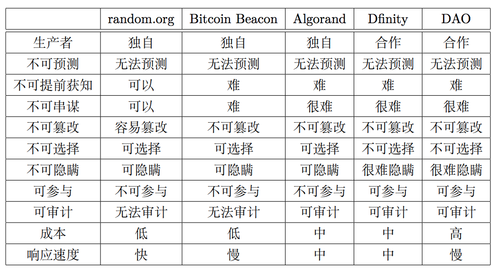

# 随机数

https://medium.com/@kkenji1024/designing-random-number-generators-41e653782a7f

## [区块链中的随机数](http://yi-programmer.com/2018-03-08_randomness-in-blockchain.html)

## [Randao可证公平随机数白皮书](https://randao.org/)

1. 真随机数与伪随机数
    1. 伪随机数一般由确定的算法生成，如果已知产生伪随机数所使用的种植或已产生的随机数，则可以获得接下来随机数序列的信息。
    2. 真随机数的产生不可预计。
2. 代表性的随机数发生器
    1. 中心化随机数发生器
        1. NIST随机数生成器：物理熵源
            1. 不可预测：任何算法都无法预测该生成器将会给出的随机数
            2. 自主：能够抵抗不相关者介入或阻止分发随机数的过程
            3. 一致：一组用户访问该服务能够确实地获得相同的随机数
        2. random.org：大气噪音
    2. BitCoin Beacon：比特币的区块数据作为随机源
        1. 缺点：无法防止“块保留攻击”：参与者可以贿赂矿工丢弃不利于自己的区块
    3. Algorand: (VRF)Verifiable Random Functions
        1. F(s,x) = v 作为随机数输出，同时痛处proof和对应s的公钥p
        2. 缺点：参与者可以不发布对于自己不利的签名
    4. Dfinity： BLS
        1. 将用户分组，第一轮由一个组产生一个随机数，之后每一轮选一个组对上一轮产生的随机数签名，作为这一轮的随机数输出。
        2. 很好的解决了Withholding的问题
    5. DAO：去中心化自治组织（Decentralized Autonomous Oragnization）
        1. 有时也叫DAC：Decentralized Autonomous Corporation）
3. 随机数发生器的评价
    
4. Commit Reveal方案
    1. 第一阶段：收集有效sha3(s)，保证金
    2. 第二阶段：收集有效s
    3. 第三个阶段：计算随机数，发放保证金及奖励
    4. 方案约束
        1. 第一阶段中，同样的sha3(s)，只接受第一个
        2. 第一阶段中，有一个最小参与人数的设定，如果在窗口期内未到达预设人数，失败
        3. sha3(s)被接受，则必须在第二阶段提交s
            1. 没提交s，保证金没收
            2. 未收集到全部s，则失败，退还其他合约费用，保证金分给发送s的生产者。
5. BLS方案
6. Commit Reveal及BLS方案评价
    1. Commit Reveal方案比较慢，生产和使用成本较高，但参与门槛低，防止串谋和可证公平
    2. BLS速度快，适用于高频，同时对于防串谋的需求不那么苛刻的场景
