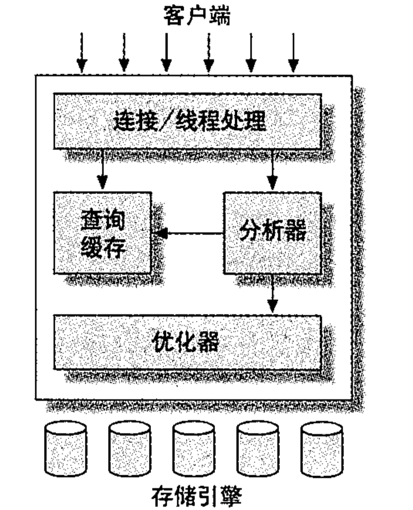
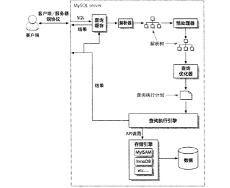
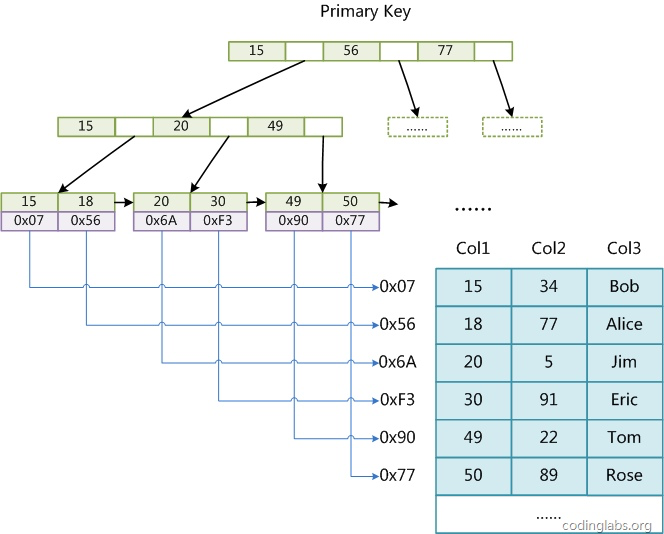
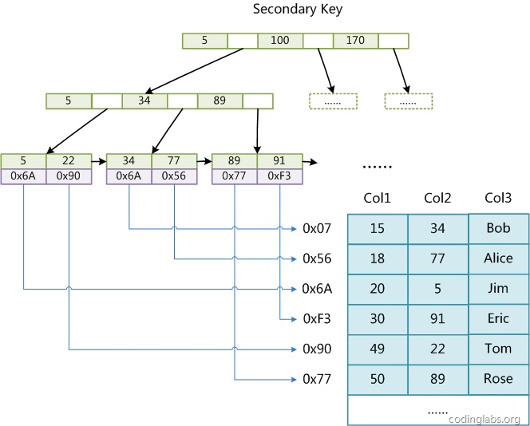
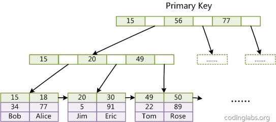
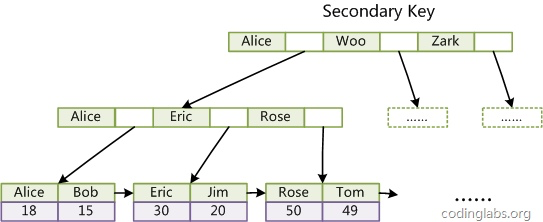

# MySQL

## MySQL使用

1. 客户端使用

    ```
    mysql [-h host] -u user -p[password] [database]
    ```
2. dump数据库

    ```
    mysqldump [-h host] -u user -p[password] [--opt][--no-data] database [table_name]
    ```
    1. 其中`--opt`为默认，使用`--skip-opt`禁用
3. 修改密码
    1. mysqladmin

    ```
    mysqladmin [-h host] -u user -p[old_password] password new_password
    ```
    2. MySQL客户端执行

    ```
    SET PASSWORD FOR user@host = PASSWORD('new_password')
    ```
    3. MySQL客户端中修改mysql数据库中user表

    ```
    use mysql;
    UPDATE user SET password = PASSEORD('new_password') WHERE use='root';
    FLUSH PRIVILEGES;
    ```
4. 装载数据
    1. MySQL客户端执行

    ```
    LOAD DATA LOCAL INFILE 'data.txt' INTO TABLE table_name LINES TERMINATED BY '\n';
    ```
    2. data.txt每行一条记录，列与`CREATE TABLE`中对应，各列用tab隔开，NULL值用`\N`表示
5. 设置远程连接

    ```
    grant all privileges on *.* to root@'%' identified by 'password'
    ```
6. The `GROUP_CONCAT` function concatenates strings from a group into one string with variois options.

    ```
    CGROUP_CONCAT(DISTINCT expression)
    ```

## MySQL优化

1. 配置
    1. [Innodb优化](http://imysql.cn/node/609)

    ```
    innodb_flush_log_at_trx_commit=2
    innodb_buffer_pool_size=200M
    innodb_flush_method=O_DIRECT
    ```
2. 查看db状态

    ```
    show innodb status \G
    ```
3. 查看死锁

    ```
    SELECT  
       r.trx_id waiting_trx_id,  
       r.trx_mysql_thread_id waiting_thread,  
       TIMESTAMPDIFF(  
           SECOND,  
           r.trx_wait_started,  
           CURRENT_TIMESTAMP  
       ) wait_time,  
       r.trx_query waiting_query,  
        l.lock_table waiting_table_lock,  
        b.trx_id blocking_trx_id,  
        b.trx_mysql_thread_id blocking_thread,  
        SUBSTRING(  
            p. HOST,  
            1,  
            INSTR(p. HOST, ':') - 1  
        ) blocking_host,  
        SUBSTRING(p. HOST, INSTR(p. HOST, ':') + 1) blocking_port,  

    IF (p.COMMAND = 'Sleep', p.TIME, 0) idel_in_trx,  
     b.trx_query blocking_query  
    FROM  
        information_schema.INNODB_LOCK_WAITS w  
    INNER JOIN information_schema.INNODB_TRX b ON b.trx_id = w.blocking_trx_id  
    INNER JOIN information_schema.INNODB_TRX r ON r.trx_id = w.requesting_trx_id  
    INNER JOIN information_schema.INNODB_LOCKS l ON w.requested_lock_id = l.lock_id  
    LEFT JOIN information_schema. PROCESSLIST p ON p.ID = b.trx_mysql_thread_id  
    ORDER BY wait_time DESC;
    ```
4. 使用`explain`来优化SQL语句：`show warnings;`
5. MYSQL查询执行过程
    1. 简单的
        
    2. 详细的
        
6. 索引介绍：Most MySQL indexes(primary key, unique, index and fulltext) are stored in B-trees. MEMORY tables also support hash index.
    1. 主键
    2. 外键
    3. 唯一索引
    4. 全文索引：InnoDB不支持全文索引
    5. 单列索引（column index）与多列索引（composite index）
    6. 聚簇索引（clustered index）（InnoDB）
    7. 覆盖索引（Covering index）
        An index that includes all the columns retrieved by a query.
    8. MyISAM索引实现
        1. Each MyISAM table is stored on disk in three files.
            1. .frm: table fromat
            2. .MYD: data file
            3. .MYI: index file
        2. 主索引与辅助索引在结构上没有任何区别，只是主索引要求key是唯一的，而辅助索引的key可以重复。索引是一棵B+ Tree，data域保存数据记录的地址。MyISAM中索引的检索算法为首先按照B+ Tree搜索算法搜索索引，如果指定的key存在，则取出其data域的值，然后以data域的值为地址，读取相应的数据记录。
        
        
    9. InnoDB索引实现
        1. 在InnoDB中，表数据文件本身就是按照B+ Tree组织的一个索引结构。这棵树的叶节点data保存了完整的数据记录，聚集索引这种实现方式使得按照主键的索引十分高效。
        2. 辅助索引中data域存储的不是数据的地址而是主键的值，辅助索引搜索需要检索两遍索引
            1. 检索辅助索引获得主键
            2. 用主键到主索引中检索获得记录
        3. If the primary key is long, the secondary indexes use more space, so it's advantageous to have a short primary key.
        4. 非单调的主键会造成在插入新纪录时数据文件为了维持B+ Tree的特性而频繁的分裂调整，十分低效。因此使用自增字段作为主键是一个比较好的选择。
        
        
7. SQL优化
    1. 最左前缀原则
    2. 如果WHERE子句的查询条件有以下情况，MySQL无法使用索引
        1. 使用了函数，如：DAY(column)
        2. 使用了比较操作符LIKE和REGEXP，只有在搜索模板的第一个字符不是通配符的情况下才能使用索引
        3. 在ORDER BY操作中，只有排序条件不是一个查询条件表达式的情况下才使用索引
    3. 可以使用FORCE INDEX强制使用某个索引
    4. MySQL一个查询只会使用一个核心

## MySQL数据库设计

1. 数据库性能的瓶颈
    1. CPU
    2. 内存
    3. 磁盘
    4. 网络
2. 数据库设计
    1. 容量评估
        1. 数据量大：分片
        2. 可用性：冗余
    2. QPS评估
    3. 读写比
        1. 读多写少：读写分离，一主多从，主写从读，缓存，索引
        2. 从库不一致：强制读主
        3. 缓存一致：双淘汰，版本号
        4. 读写相近或写多读少：不要使用缓存
    4. 分表分库
        1. 垂直拆分：冷热字段拆分
        2. 水平拆分：sharding
    5. 分页查询技巧
        1. 根据id进行比较，查询id币查询整条记录要快的多
        2. 跨库分页：算法类比：两个已排序数组中间的数
