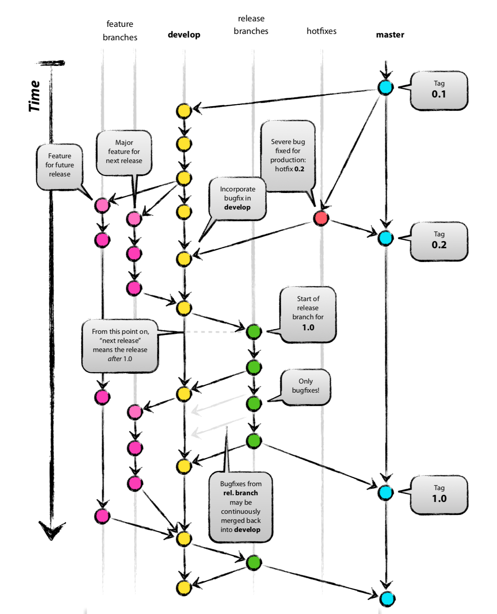

# Git

## git分支管理

[A successful git branching model](https://nvie.com/posts/a-successful-git-branching-model/)



## 常见问题

1. pull 代码时服务器代码与本地修改有冲突

    ```
    git stash
    git pull
    git stash pop
    ```
2. push 时强制覆盖远程仓库

    ```
    git push --force
    ```
3. 查看分支

    ```
    git branch // 本地分支
    git branch -a // 所有分支
    ```
4. 删除分支

    ```
    git branch -d <branch_name> // 删除本地分支
    git push origin :<branch_name> // 删除远程分支
    git push origin --delete <branch_name> // 删除远程分支
    ```
5. 删除tag

    ```
    git tag -d <tag_name>   // 删除本地tag
    git push origin :refs/tags/<tag_name> // 删除远程tag
    git push origin --delete tag <tag_name> // 删除远程tag
    ```
6. 推送tag

    ```
    git push origin <tag_name> // 推送指定tag
    git push --tags  // 推送所有tag
    ```
7. 查看更改
    1. git diff: 查看unstaged的更改
    2. git diff --cached: 查看staged 但是没有committed的更改
    3. git diff branch1 branch2: 可以查看两个不同的branch的diff，因此可以用来查看本地分支和远程分支的diff
    4. git show <commit>：查看某个commit修改的内容
    5. git log --stat: 查看修改的文件
8. 替换本地改动
    1. git checkout <filename>: 使用本地仓库中版本覆盖工作区
    2. git fetch origin; git reset --hard origin/maser: 使用远程仓库覆盖本地仓库
9. 查看log：git log --pretty=oneline
10. 查看操作记录：git reflog 或 git log -g
11. 回滚到指定版本： git reset [commit]
    1. --soft： 还原HEAD
    2. --mixed：还原HEAD、Index // 默认参数
    3. --hard: 还原HEAD、Index、Working Directory
    4. 其实就是--soft,--mixed以及--hard三个恢复等级
        1. --soft就仅仅将头指针恢复，已经add的缓存以及工作空间的所有东西都不变
        2. --mixed，就将头恢复，已经add的缓存也会丢失掉，工作空间的代码不变
        3. --hard：一切都恢复了，头变，add的缓存消失，代码恢复到以前状态
12. change submodule remote url：
    1. modify .gitmodules
    2. git submodule sync (modify .git/config)
    3. rm -rf .git/modules/external & submodule directory
    4. git submodule update --init
13. 嵌套submodule
    1. git submodule update --init --recursive
14. 查看某个文件的修改
    1. git whatchanged filename: 显示某个文件的每个版本提交信息：提交日期，提交人员，版本号，提交备注
15. 更新远程分支信息

    `git remote prune origin`
16. 远程强制覆盖本地

    ```
    git fetch -all
    git reset --hard origin/xxx
    或
    git reset --hard @{upstream}
    ```

## Pro Git

### config

1. config files
    1. /etc/gitconfig: git config --system
    2. ~/.gitconfig: git config --global
    3. .git/config: git config --local
2. first-time git setup:

    ```
    git config --global user.name "your name"
    git config --global user.email "your email"
    git cofnig --global core.editor /usr/bin/vim
    git config --global merge.tool vimdiff

    // optional
    git config --global alias.co checkout
    git config --global alias.br branch
    git config --global alias.ci "commit -a"
    git config --global alias.st status
    git config --global alias.pl "pull -r"
    ```

3. check your settings:
    `git config --list`

### git basics

1. init
    1. git init
    2. git clone
2. changes
    1. git add
    2. git status
    3. git diff: to see what is still unstaged
    4. git diff --cached: to see what is staged but not committed
    5. git diff --check: check for whitespace
    6. git commit [-a] [-m] [--amend]:
        1. -a: commit all changed file(including unstaged ones)
        2. -m: comments
        3. --amend: amend a merge commit
    7. git rm [-f] [--cached]: remove from git.
        1. -f: remove already staged
        2. --cached: only remove from git not from local
    8. git mv
3. history
    1. git log
        1. -p: show the diff introduced in each commit
        2. -2: limit the output to only the last 2 entries
        3. --stat: show the moditied files in each commit
        4. --pretty=online/short/full/fuller/format
4. undo
    1. git reset [HEAD] --soft: reset the HEAD to a certain commit, don't touch the index file and the working tree
    2. git reset [HEAD] --hard: reset the index file and working tree
    3. git checkout <filename>: discard changes in working copy with staged/committed file
    4. git revert: revert some existing commits
5. remote
    1. git remote [-v]: show remote
    2. git remote add <remote_name> <remote_url>: add a remote repository
    3. git fetch [remote_name][branch_name]: when you do a fetch that brings down new remote branches, you don't automatically have local, editable copies of them. you can merge it to your current working branch. if you want a local branch that you can work on, you must create it yourself.
    4. git push [remote_name][branch_name]:push to rmote branch
    5. git push [remote_name][local_branch][remote_branch]: push local branch to remote branch, delete remote branch by supplying no local branch
    6. git remote show remote_name: show information for remote_name
    7. git remote rename old_remote_name new_remote_name
    8. git remote rm remote_name
6. tag
    1. git tag [-l v1.4.2]: show tags, use '-l' to look up for certain tags
    2. git tag -a/-s v1.4 -m 'my version 1.4': create an annotated tag, use '-s' to create a signed tag
    3. git tag v1.4: create a lightweight tag
    4. git show v.1.4 see the tag data
    5. git tag -v v1.4: verify a signed tag
    6. git tag -a v1.2 commit_id: create tag on a certain commit
    7. git push origin <tagname>: push a tag to remote server
    8. git tag new old; git tag -d old; git push origin:refs/tags/old; git push --tags;

### git branch
1. basic
    1. git branch <brach_name>: create a new branch
    2. git checkout [-b] <branch_name> [remote_name/branch_name]: swith to a branch, use '-b' to create a new branch (based on a remote branch)
    3. merge hotfix to master

    ```
    git checkout master
    git merge hotfix
    ```
    4. merge

    ```
    git mergetool
    ```
2. branch management
    1. git branch [-v]: show branches information
    2. git branch --merged or --no-merged: list the branches that have or have not yet merged into the branch you've currently on
    3. git branch -d <branch_name>: delete a certain branch
3. rebase
    1. `git checkout develop; git rebase master;`: rebase develop onto master. after rebase, you can do a fast-forward merge on master.
    2. `git rebase master server`: rebase server onto master without haveing to checkout server first
    3. `git rebase --onto master server client`: checkout the client branch, figure out the patches from the common ancestor of the client and server branches, and then replay them onto master.
    4. **DO NOT** rebase commits that you have pushed to a public repository.

### patch

```
git diff <commit_id> > PATCH
git apply [--check] PATCH

git format-patch <commit_id>
git am PATCH
```
